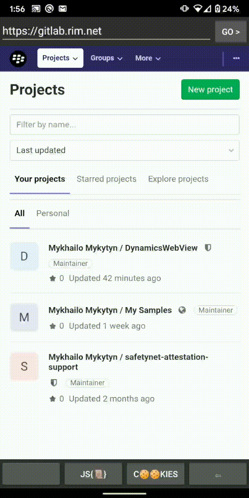

# BlackBerry Dynamics WebView client sample
This application is a simple web content browser supporting access to private/corporate network resources through BlackBerry Dynamics SDK.

App's functionality includes:                                                       []
 * URL input bar
 * Page history navigation
 * http cookies listing
 * JavaScript evaluate console
 * WebSettings screen

## Requirements
 * Android Studio 3.3+
 * Android Gradle plugin 3.2.0
 * BlackBerry Dynamics SDK 7.0 or newer

## Runtime
 * Android 7.0 or later (SDK 24+)
 * Android system WebView update 80+

## Author(s)

* [Mykhailo Mykytyn](mailto:mmykytyn@blackberry.com)

## How To Build and Deploy

1. Set up BlackBerry Dynamics environment
2. Clone the repo to your computer.
3. Launch Android Studio and import the project's root folder
4. Edit app's package name to your own (the default is com.good.gd.example.apachehttp)
6. Edit GDApplicationID to your own in the './application/src/main/assets/settings.json'(the default is com.good.gd.example.apachehttp)
7. Build, deploy and run on a testing device using IDE or CLI
   1. Android Studio
      1. Run the "Application" configuration
   1. Command Line
      1. execute './gradlew clean build installRelease'

## Additional app dependencies
* ['org.brotli:dec:0.1.2'](https://mvnrepository.com/artifact/org.brotli/dec/0.1.2)

## Project structure
 * `android.webkit` custom components:
    * `BBWebViewClient` - custom WebView client, it's an entry point class for content loading
    * `BBDServiceWorkerClient` - custom ServiceWorker implementation intercepting service worker requests
    * `BBResponseInputStream` - custom InputStream, provides the response data for a WebView to consume
    * `BBWebResourceResponse` - custom WebResourceResponse class. Manages response codes, headers and data streams.
    * `RequestInterceptor` - interprets WebView requests and schedules appropriate http reuquests.
 * package `com.good.gd.webview_V2.bbwebview.tasks.http`
   

## License

Apache 2.0 License

## Disclaimer

THE SOFTWARE IS PROVIDED "AS IS", WITHOUT WARRANTY OF ANY KIND, EXPRESS OR IMPLIED, INCLUDING BUT NOT LIMITED TO THE WARRANTIES OF MERCHANTABILITY, FITNESS FOR A PARTICULAR PURPOSE AND NONINFRINGEMENT. IN NO EVENT SHALL THE AUTHORS OR COPYRIGHT HOLDERS BE LIABLE FOR ANY CLAIM, DAMAGES OR OTHER LIABILITY, WHETHER IN AN ACTION OF CONTRACT, TORT OR OTHERWISE, ARISING FROM, OUT OF OR IN CONNECTION WITH THE SOFTWARE OR THE USE OR OTHER DEALINGS IN THE SOFTWARE.
